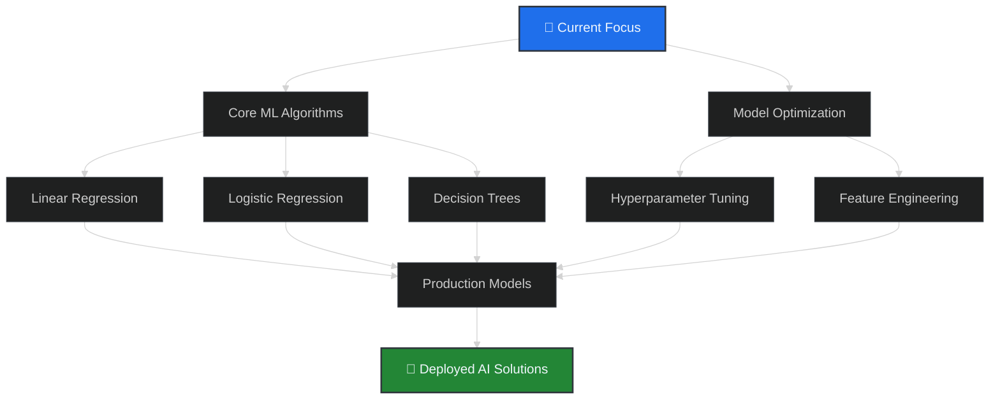

<!-- GitHub Profile README | Mohammad Soban -->

<!-- Animated Header with Gradient Waves -->

  

<!-- Dynamic Typing Effect -->

  

 

## 🚀 About Me

- 🔭 **Currently Working On**: Building intelligent backend systems with AI integration
- 🌱 **Deep Diving Into**: Advanced ML models (Regression, Classification, Neural Networks)
- 👯 **Looking to Collaborate On**: AI-powered legal tech solutions
- 🤔 **Exploring**: Ethical AI implementation and system architecture patterns
- 💡 **Passionate About**: Creating technology that solves real-world problems
- 🎓 **Background**: Computer Science with Law - Bridging tech and legal frameworks
- ✨ **Unique Value**: Combining technical depth with cross-disciplinary perspective

 

## 🌐 Professional Connect

  
  
  
  

 

## 🛠️ Technical Arsenal

### 🤖 AI/ML Development Stack

  
  
  
  
  
  

### ⚡ Backend & Cloud Stack

  
  
  

### 🌐 Full Stack & Languages

  
  
  
  
  

### 🔧 Tools & Platforms

  
  
  
  
  

 

## 📊 GitHub Analytics

  

 

## 🔥 Contribution Dynamics

  

 

## 🏆 GitHub Milestones

  

 

## 🌟 Featured Projects

  <table>
    <tr>
      <td width="50%" align="center">
        
      </td>
      <td width="50%" align="center">
        
      </td>
    </tr>
    <tr>
      <td width="50%" align="center">
        
      </td>
      <td width="50%" align="center">
        
      </td>
    </tr>
  </table>

 

## 🛣️ Machine Learning Roadmap

💭 Developer Mantra

  

📊 Profile Metrics

     

<!-- Animated Footer -->

  

  <h3>🚀 Get In Touch!</h3>
  
<i>💡 "First, solve the problem. Then, write the code." – John Johnson</i>

  
<b>📧 Email • 💼 LinkedIn • 💻 GitHub • 🗓️ Let's Collaborate</b>

  

